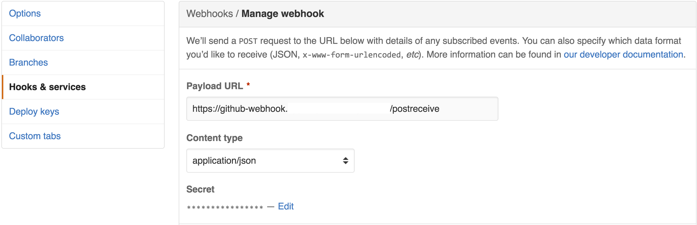

# github-webhook

Configurable GitHub WebHook deployable on CloudFoundry


```yaml
triggers:
  - name: master_webhook
    event: push
    rules:
      - ref: refs/heads/master
        pusher.name: username
        commits.modified: README.md
    run:
      path: script/trigger
      args:
        - "master"
```

The webhook matches by looking at the event (`push` or `pull_request`) and the rules that have been defined.

The Github [Push](https://developer.github.com/v3/activity/events/types/#webhook-payload-example-13) and
[Pull](https://developer.github.com/v3/activity/events/types/#pullrequestevent) events are flattened, so that we can
find a matching rule key and value.

For example, given `Push` event:

```json
{
  "ref": "refs/heads/master",
  "commits": [{
  "distinct": true,
  "message": "Update README.md",
  "author": {
    "name": "Mendez, Marcos",
    "email": "spam@somewhere.com",
    "username": "aaabbbccc"
  },
  "modified": ["README.md"]
  }], ...
}
```

We'll be able to create rules such as:

* ref: refs/heads/master
* distinct: true
* commits.author.username: username
* message: Update README.md
* commits.modified: README.md

# Getting Started

While this webhook is not directly coupled with Concourse, I've built it to provide functionality currently missing.
In order to minimize the polling to Github Enterprise.

*The better and long-term solution is to add this functionality into Concourse CI itself.*

## Pre-requisites

* Install `VirtualBox` or `VMWare` software hypervisor of choice
* Install [vagrant](https://vagrantup.com)
* Install & [configure](https://help.github.com/categories/setup/) git
  
  ```shell
  git config --global core.autocrlf input
  git config --global push.default simple
  git config --global user.name "My Name"
  git config --global user.email "your_email@example.com"
  ```

### Windows Users

    The deployment scripts require Windows x64 and CPU Virtualization
    Virtualization is disabled by default
    Contact Desktop Services to upgrade to x64 or enable Virtualization
    Ensure that git is available from your command-line (Git Bash recommended)

## Concourse CI

If you haven't already done so, setup a CI server following Chris Gruel's instructional video on [YouTube](https://www.youtube.com/watch?v=WdSUxEIdO50).

### Build

* Make sure you've read and followed the *pre-requisites*
* Clone this repo
* Run `./vssh`. This will ssh into the disposable vm
* Run `script/cibuild` to run the build
```shell
git config --global core.autocrlf input
git clone <this repo>
cd github-webhook

./vssh

./script/cibuild
```
### Deploy

* Run `./vssh`. This will ssh into the disposable vm
* Setup Concourse CI URL
* Setup Concourse CI Target
* Setup LDAP credentials in order to automatically retrieve a bearer token:
* Login to Concourse CI
* Run `script/concourse` to setup `github-webhook` and push [pipeline.yml](pipeline.yml)
* Login to NP CloudFoundry
* Setup GitHub Web Hook Secret
* Set CloudFoundry app name; `github-webhook` is already the default :)
* Run `script/deploy`
```shell
./vssh

export CONCOURSE_URL="http://<my-concourse-ci>.somewhere.com"
export CONCOURSE_TARGET=main
export GITHUB_LDAP_USERNAME=<ldap-user-name>
export GITHUB_LDAP_PASSWORD=<ldap-password>
export GITHUB_SECRET=<my-github-secret>
export CF_APP_NAME=<my-cloudfoundry-webhook-app-name>

echo "remember to use the same ldap credentials to login to test getting a bearer token"
fly -t $CONCOURSE_TARGET login -c $CONCOURSE_URL

script/concourse

cf login -a api.run.somewhere.com

./script/deploy
```

Note that `script/deploy` does not bind any routes to the deployed `github-webhook` app. After deployment,
it's necessary to bind the desired route to the app via `cf map-route` such that the app is available to GitHub over HTTP.

### GitHub

You can use an existing project for this, or create a new one if you're not too sure yet.

* Follow the [instructions](https://developer.github.com/webhooks/creating/) on adding a webhook using the PCF app webhook (e.g. `https://<my-webhoook-app>.apps.somewhere.com/postreceive`)
* Make sure you use the same secret defined in `GITHUB_SECRET`



* You can enable `Push` and `Pull request` event types


### Test It

* Make a change and commit it or create a pull request, or re-deliver an existing delivery
* Run `cf logs <my-webhook-app>`
```shell
$ cf logs github-webhook
Connected, tailing logs for app github-webhook in ...

OUT 2016/10/03 09:53:14 Executing github_push
OUT 2016/10/03 09:53:14 Redirecting stdout/stderr for github_push
OUT triggered by push
OUT logging into http://XXXX.somewhere.com/main
OUT target saved
OUT downloading fly from http://XXXX.somewhere.com...
OUT triggering job github-webhook/github-webhook
OUT started github-webhook/github-webhook #1
OUT 2016/10/03 09:53:14 github_push was successful!
```

### Make It Your Own

* Fork this project for your team (e.g. clone it, rename it, tweak it)
* Look at the following configuration files [config.simple.yml](config.simple.yml) [config.concourse.yml](config.concourse.yml) [config.concourse.rules.yml](config.concourse.rules.yml)
* Look at the following scripts: [script/concourse](script/concourse) [script/settings](script/settings) [script/trigger](script/trigger) [script/trigger-check](script/trigger-check)
* Change CONFIG_YML on [script/settings](script/settings) to deploy different configurations
* Turn on [autoscaling](http://docs.pivotal.io/pivotalcf/1-8/appsman-services/autoscaler/autoscale-configuration.html) for your webhook
* Contribute to the project

# Credit & Inspiration

* [adnanh/webhook](https://github.com/adnanh/webhook)
* [agrison/harpoon](https://github.com/agrison/harpoon)
* [phayes/hookserve](https://github.com/phayes/hookserve)
* [xogeny/go-hooksink](https://github.com/xogeny/go-hooksink)
* [cloud-foundry/jenkins](https://github.homedepot.com/cloud-foundry/jenkins)
* [concourse/atc](https://github.com/concourse/atc)

# TODO

* Incorporate this functionality into Concourse
* More tests

# Contributors

Marcos Mendez

Chris Elder

Steven Herring

Karthigayan Devan
